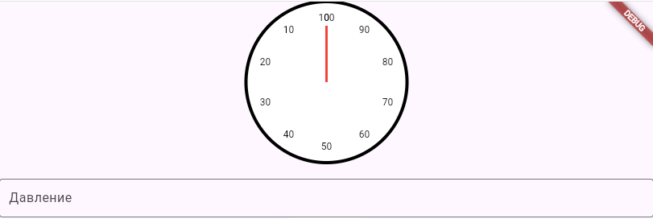
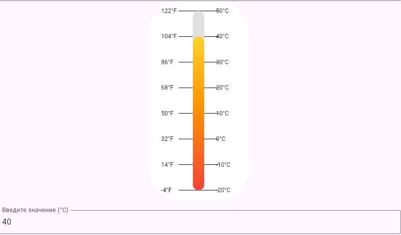

# Custom RenderObjects Example

Данный проект показывает пример создания и использования на практике низкоуровнего рисования при помощи RenderObject

На изображении ниже показан термометр с двумя видами анимации - естественной тряски стрелки и изменения положения стрелки при вводе нового значения в текстовое поле.

Ниже показан градусник с анимацией изменения значения.

